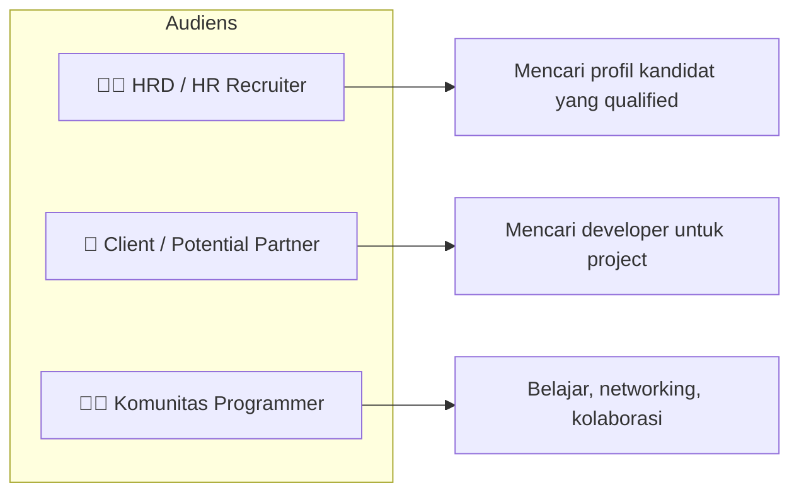
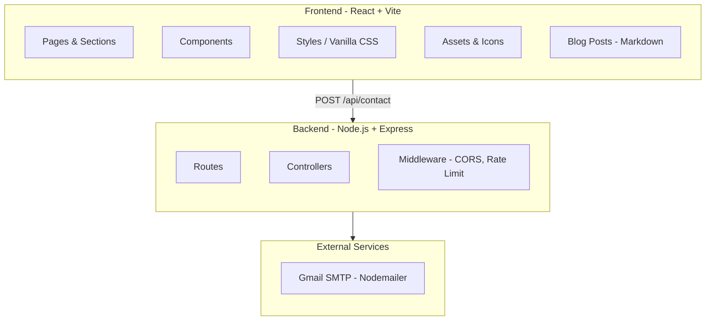
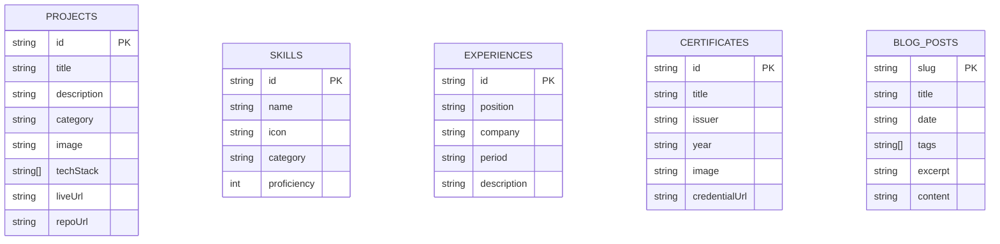
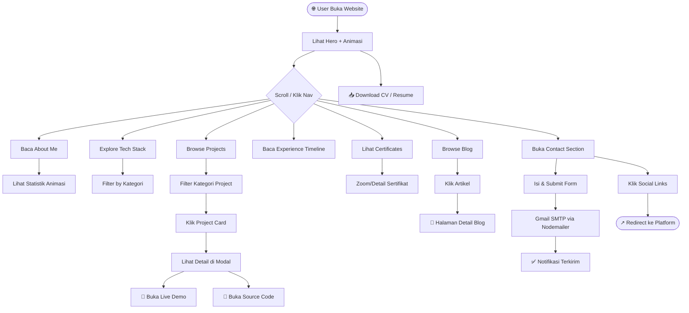

# Product Requirements Document (PRD)
# Personal Portfolio Website

| Field | Detail |
|-------|--------|
| **Nama Produk** | Personal Portfolio Website |
| **Versi** | 1.0 |
| **Tanggal** | 25 April 2026 |
| **Status** | Draft → Approved |

---

## 1. Ringkasan Eksekutif

Website portofolio pribadi yang modern dan unik, dirancang untuk menampilkan profil profesional, project, tech stack, sertifikasi, dan artikel blog. Website ini ditujukan sebagai acuan utama bagi **HRD/HR**, **Client**, dan **Komunitas Programmer** yang ingin mengenal kemampuan dan pengalaman developer secara mendalam.

### 1.1 Problem Statement

Seorang developer membutuhkan media online yang profesional, interaktif, dan berkesan untuk memperkenalkan diri kepada calon rekruter, klien, dan komunitas. Resume PDF dan profil LinkedIn sering kali terlalu statis dan tidak mampu menampilkan kedalaman skill serta portofolio secara visual.

### 1.2 Solusi

Membangun single-page portfolio website dengan estetika **dark neo-futuristic** yang dilengkapi section interaktif: Hero, About, Tech Stack, Projects, Experience, Certificates, Blog, dan Contact Form terintegrasi email.

---

## 2. Tujuan & Keberhasilan

### 2.1 Tujuan Produk

| # | Tujuan | Indikator Keberhasilan |
|---|--------|------------------------|
| 1 | Menampilkan profil profesional yang **impresif** | Desain visual mendapat kesan positif dari target audiens |
| 2 | Mempermudah **kontak** dari HRD/Client | Contact form berfungsi end-to-end via Gmail SMTP |
| 3 | Menunjukkan **kemampuan teknis** secara visual | Tech Stack section interaktif dengan proficiency level |
| 4 | Menjadi **portofolio hidup** yang terus diupdate | Blog dan Projects mudah ditambah/diupdate |
| 5 | Tampil **responsif dan performant** | Lighthouse score ≥ 90 di semua kategori |

### 2.2 KPI (Key Performance Indicators)

- **Lighthouse Performance Score** ≥ 90
- **Lighthouse SEO Score** ≥ 90
- **Time to First Contentful Paint** < 1.5 detik
- **Contact Form Success Rate** = 100% (email terkirim)
- **Mobile Responsiveness** = Tampil sempurna di 320px–1440px

---

## 3. Target Audiens

### 3.1 Persona Utama



| Persona | Kebutuhan | Apa yang Dicari |
|---------|-----------|-----------------|
| **HRD/HR** | Menilai kompetensi teknis kandidat | Tech stack, project, pengalaman kerja, sertifikasi |
| **Client** | Mencari developer yang tepat untuk project | Portofolio project, live demo, skill relevance |
| **Komunitas** | Belajar dan networking | Blog artikel teknis, profile, link sosial media |

---

## 4. Functional Requirements

### 4.1 Navigasi & Layout

| ID | Requirement | Prioritas |
|----|------------|-----------|
| FR-01 | Navbar fixed dengan link smooth-scroll ke setiap section | P0 |
| FR-02 | Hamburger menu pada viewport mobile (< 768px) | P0 |
| FR-03 | Dark/Light theme toggle dengan transisi smooth | P1 |
| FR-04 | Footer dengan copyright dan social links | P2 |

### 4.2 Hero Section

| ID | Requirement | Prioritas |
|----|------------|-----------|
| FR-05 | Menampilkan nama, title/role, dan tagline | P0 |
| FR-06 | Tombol CTA: "Download CV" dan "Contact Me" | P0 |
| FR-07 | Social media icons (GitHub, LinkedIn, Email) | P0 |
| FR-08 | Background animasi (particles / mesh gradient) | P1 |
| FR-09 | Glitch text effect pada nama | P1 |

### 4.3 About Me

| ID | Requirement | Prioritas |
|----|------------|-----------|
| FR-10 | Foto profil dan bio paragraph | P0 |
| FR-11 | Counter statistik animasi (tahun experience, jumlah project, tech count) | P1 |
| FR-12 | Scroll-triggered reveal animation | P1 |

### 4.4 Tech Stack

| ID | Requirement | Prioritas |
|----|------------|-----------|
| FR-13 | Grid layout skill dengan ikon teknologi | P0 |
| FR-14 | Kategori filter (Frontend, Backend, Tools) | P0 |
| FR-15 | Proficiency level indicator (progress bar) | P1 |
| FR-16 | Hover effect pada card skill | P1 |

### 4.5 Projects Showcase

| ID | Requirement | Prioritas |
|----|------------|-----------|
| FR-17 | Grid/card layout project dengan gambar thumbnail | P0 |
| FR-18 | Filter by kategori (All, Web, Mobile, API) | P0 |
| FR-19 | Modal detail project saat card diklik | P0 |
| FR-20 | Link ke Live Demo dan Source Code di modal | P0 |
| FR-21 | Tech tags pada setiap project card | P1 |

### 4.6 Experience Timeline

| ID | Requirement | Prioritas |
|----|------------|-----------|
| FR-22 | Timeline vertikal dengan dot indicator | P0 |
| FR-23 | Menampilkan: posisi, perusahaan, periode, deskripsi | P0 |
| FR-24 | Scroll-triggered reveal per item | P1 |

### 4.7 Certificates

| ID | Requirement | Prioritas |
|----|------------|-----------|
| FR-25 | Grid card layout sertifikasi | P0 |
| FR-26 | Gambar thumbnail sertifikat | P0 |
| FR-27 | Detail: judul, issuer, tahun | P0 |
| FR-28 | Klik untuk zoom/detail sertifikat | P1 |

### 4.8 Blog

| ID | Requirement | Prioritas |
|----|------------|-----------|
| FR-29 | List card artikel pada homepage section | P0 |
| FR-30 | Setiap card: tanggal, tags, judul, preview | P0 |
| FR-31 | Halaman detail per blog post (React Router) | P0 |
| FR-32 | Konten blog dari markdown files (react-markdown) | P0 |
| FR-33 | Tombol "Baca selengkapnya" menuju halaman detail | P0 |

### 4.9 Contact Section

| ID | Requirement | Prioritas |
|----|------------|-----------|
| FR-34 | Form kontak: nama, email, pesan | P0 |
| FR-35 | Submit form mengirim email via Gmail SMTP (Nodemailer) | P0 |
| FR-36 | Toast notifikasi sukses/error setelah submit | P0 |
| FR-37 | Informasi kontak: email, LinkedIn, GitHub, lokasi | P0 |
| FR-38 | Form validation (required fields, email format) | P0 |

---

## 5. Non-Functional Requirements

| ID | Requirement | Target |
|----|------------|--------|
| NFR-01 | **Performance** — First Contentful Paint | < 1.5 detik |
| NFR-02 | **Performance** — Lighthouse score | ≥ 90 |
| NFR-03 | **Responsiveness** — Viewport support | 320px – 1440px+ |
| NFR-04 | **SEO** — Meta tags, heading hierarchy, semantic HTML | Lighthouse SEO ≥ 90 |
| NFR-05 | **Accessibility** — Keyboard navigation, contrast ratio | WCAG 2.1 AA |
| NFR-06 | **Browser Support** — Chrome, Firefox, Safari, Edge | Versi terbaru |
| NFR-07 | **Security** — Rate limiting pada API contact | Maks 5 req/menit |
| NFR-08 | **Security** — Input sanitization pada form | XSS prevention |
| NFR-09 | **Animasi** — Smooth 60fps pada semua efek | Tidak ada frame drops |

---

## 6. Tech Stack



| Layer | Teknologi | Alasan |
|-------|-----------|--------|
| **Frontend** | React 19 + Vite | Modern, fast HMR, optimized build |
| **Routing** | React Router v7 | Client-side routing untuk Blog detail pages |
| **Styling** | Vanilla CSS + Custom Properties | Full control, no framework overhead |
| **Animasi** | Framer Motion + CSS Animations | Declarative, performant motion |
| **Icons** | React Icons / Lucide | Comprehensive icon library |
| **Blog Engine** | Markdown + react-markdown | Simple, developer-friendly content |
| **Backend** | Node.js + Express | Lightweight API untuk contact form |
| **Email** | Nodemailer + Gmail SMTP | Free, reliable email delivery |
| **Deployment** | Vercel (FE) + Railway (BE) | Zero-config, CI/CD built-in |

---

## 7. Data Model

### 7.1 Static Data (JSON files di `client/src/data/`)



### 7.2 API Endpoint

| Method | Endpoint | Body | Response |
|--------|----------|------|----------|
| `POST` | `/api/contact` | `{ name, email, message }` | `{ success: true, message: "Email terkirim" }` |

---

## 8. User Flow



---

## 9. Design Specifications

### 9.1 Estetika: Dark Neo-Futuristic

| Aspek | Spesifikasi |
|-------|-------------|
| **Tema Utama** | Dark-mode dengan aksen neon/cyan |
| **Estetika** | Neo-brutalist meets futuristic — grid lines, glow effects, noise texture |
| **Font Display** | Syne / Clash Display (bold, geometric) |
| **Font Body** | DM Sans / Satoshi (clean, readable) |

### 9.2 Color Palette

| Token | Hex | Penggunaan |
|-------|-----|------------|
| `--bg-primary` | `#0a0a0f` | Background utama |
| `--accent-cyan` | `#00f0ff` | Aksen, link, highlight |
| `--accent-magenta` | `#ff3c78` | CTA buttons, hover states |
| `--text-primary` | `#f5f5f5` | Teks utama |
| `--text-muted` | `#8a8a9a` | Teks sekunder |
| `--surface` | `#12121a` | Card backgrounds |
| `--border` | `#1e1e2e` | Borders, dividers |

### 9.3 Efek Visual

- **Custom Cursor** — Lingkaran kecil mengikuti mouse dengan smooth lerp
- **Grain Overlay** — Subtle noise texture pada background
- **Glitch Text** — Efek glitch pada nama di Hero Section
- **Scroll Reveal** — Elemen muncul dengan fade + translate saat masuk viewport
- **Hover Glow** — Card dan button memiliki glow effect saat hover
- **Parallax** — Multi-layer parallax pada Hero background

### 9.4 Responsive Breakpoints

| Breakpoint | Width | Perubahan |
|------------|-------|-----------|
| **Mobile** | ≤ 480px | Single column, hamburger nav, stacked cards |
| **Tablet** | 481–768px | 2-column grid, collapsed nav items |
| **Desktop** | 769–1024px | Full layout, sidebar nav visible |
| **Wide** | ≥ 1025px | Max-width container, optimal spacing |

---

## 10. Folder Structure

```
porto-react-node/
├── client/                  # React Frontend
│   ├── public/
│   ├── src/
│   │   ├── assets/          # Gambar, font
│   │   ├── components/      # Reusable components
│   │   │   ├── Navbar/
│   │   │   ├── Hero/
│   │   │   ├── About/
│   │   │   ├── TechStack/
│   │   │   ├── Projects/
│   │   │   ├── Experience/
│   │   │   ├── Certificates/
│   │   │   ├── Blog/
│   │   │   ├── Contact/
│   │   │   └── Footer/
│   │   ├── content/         # Blog markdown posts
│   │   ├── data/            # Static data (projects, skills, certs)
│   │   ├── hooks/           # Custom hooks
│   │   ├── pages/           # Blog detail page (React Router)
│   │   ├── styles/          # Global CSS + variables
│   │   ├── App.jsx
│   │   └── main.jsx
│   └── package.json
├── server/                  # Node.js Backend
│   ├── src/
│   │   ├── routes/
│   │   ├── controllers/
│   │   └── index.js
│   └── package.json
└── README.md
```

---

## 11. Milestones & Timeline

| Phase | Deliverable | Estimasi |
|-------|------------|----------|
| **Phase 1** | Setup project (Vite + Express), Design System CSS | 1 hari |
| **Phase 2** | Navbar, Hero, About, Tech Stack sections | 1–2 hari |
| **Phase 3** | Projects, Experience, Certificates sections | 1–2 hari |
| **Phase 4** | Blog section + detail page (React Router) | 1 hari |
| **Phase 5** | Contact form + Backend API (Gmail SMTP) | 1 hari |
| **Phase 6** | Animations, theme toggle, polish & responsive | 1 hari |
| **Phase 7** | Testing, optimization, deployment | 1 hari |

**Total Estimasi: 7–9 hari**

---

## 12. Risiko & Mitigasi

| Risiko | Impact | Mitigasi |
|--------|--------|----------|
| Gmail SMTP rate limit | Email gagal terkirim | Implement rate limiting + fallback error message |
| Animasi berat di mobile | Performa turun | `prefers-reduced-motion` media query, disable parallax di mobile |
| SEO terbatas (SPA) | Tidak terindex Google | React Helmet untuk meta tags, proper heading hierarchy |
| Blog content management | Sulit update konten | Markdown files sederhana, bisa di-update tanpa rebuild |

---

## 13. Out of Scope (v1.0)

- CMS / Admin panel untuk manage konten
- Multi-language (i18n)
- Analytics dashboard
- Testimonials dari client
- Authentication / login
- Database (PostgreSQL / MongoDB)
- Comment system pada blog

---

## 14. Keputusan Desain

| Keputusan | Opsi yang Dipilih | Alasan |
|-----------|-------------------|--------|
| **Data konten** | Placeholder / static JSON | Cepat develop, mudah replace dengan data asli nanti |
| **Email service** | Gmail SMTP via Nodemailer | Gratis, mudah setup dengan App Password |
| **Blog engine** | Markdown files + react-markdown | No database needed, developer-friendly |
| **Design direction** | Dark neo-futuristic | Modern, unik, memorable, sesuai persona tech |
| **CSS approach** | Vanilla CSS + custom properties | Full control, no framework dependency |
